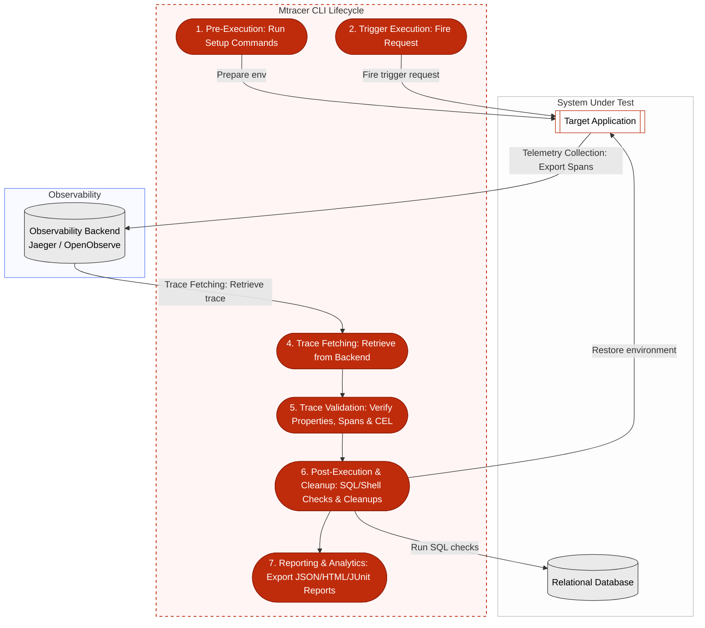

<p align="center">
  
</p>

**[Mtracer](https://mtracer-project.github.io/)** is a CLI tool for end-to-end testing powered by trace validation. It enables developers to define assertions in YAML files, execute tests, and verify application behavior directly against OpenTelemetry traces.

[![License][License-Image]][License-Url] [![Build][Build-Status-Image]][Build-Status-Url] [![Release][Release-Image]][Release-Url] [![GitHub Downloads][GitHub-Image]][Somsubhra-URL]

---

## Key Features

- **Trigger**: Initiate a trace by executing a trigger action (such as `HTTP`, `gRPC`, `NATS`, `JetStream`, `Playwright`, or direct `traceId`). The trigger injects a unique `trace_id` that propagates through the application's services.
- **Define Expected Trace and Spans**: Specify the structural expectations of the generated trace. You can verify that the trace contains specific sequences of spans (either as a strictly ordered chain or an unordered set) matching attributes like service name, operation name, span kind, status, and duration boundaries.
- **Custom Assertions on Generated Trace**: Perform specific, complex validation rules on the collected trace using Google's **Common Expression Language (CEL)**. You can run expressions against trace metrics (e.g. duration) and collections of spans.
- **Setup Commands**: Prepare the test environment before execution with lifecycle setup commands (e.g. running local shell tasks or injecting delays into the network of a container) and define corresponding cleanup commands to restore the environment after the test finishes.
- **Post-Execution Checks**: Run verification commands (such as executing raw SQL queries on databases like PostgreSQL or running shell validation scripts) to verify that side-effects have occurred successfully.
- **Analytics Export**: Generate trace and span performance analytics on one or multiple runs of the same test. Statistics can be exported to standard `JSON` or an interactive, rich `HTML` report for profiling.
- **Test Results Export**: Output overall test outcomes to multiple formats simultaneously (including `JSON`, `JUnit` or `Markdown`) for easy integration with CI/CD dashboards.

---

## How It Works




Mtracer operates as an end-to-end testing orchestrator using the following lifecycle:

1. **Pre-Execution**: Mtracer runs any specified `setupCommands` to prepare the test environment.
2. **Trigger Execution**: Mtracer executes the configured `trigger` (e.g., an HTTP or gRPC call). It injects a unique `trace_id` into the request header which propagates through the services under test.
3. **Telemetry Collection**: The application under test processes the trigger request and exports the generated spans to an **observability backend** (such as Jaeger or OpenObserve) in the standard OpenTelemetry (OTel) format.
4. **Trace Fetching**: Mtracer queries the observability backend using the request's `trace_id` to retrieve the full trace. It handles delays and retries using `waitBeforeFetch`, `retryDelay`, and `timeout` values, or terminates polling early once the expected `lastSpan` is detected.
5. **Trace Validation**: Mtracer verifies trace metrics against `expectedProperties` (span count, error count, durations) and checks span hierarchies under `expectedTraces`. It then evaluates custom boolean expressions defined in the `assertions` section using CEL.
6. **Post-Execution & Cleanup**: Mtracer executes database SQL queries or shell scripts under `postExecChecks` to verify side-effects, and runs the configured cleanup commands to restore the environment.
7. **Reporting & Analytics**: Finally, test results and trace analytics are exported in the chosen formats (JUnit, Markdown, JSON, HTML).

---

## Installation & Uninstallation
There are multiple ways to install Mtracer depending on your operating system. Visit the [Installation Page](https://mtracer-project.github.io/install/) for detailed instructions.

### macOS & Linux
Install the latest release using the terminal installation script:
```bash
curl -sL https://raw.githubusercontent.com/mtracer-project/mtracer/main/install.sh | bash
```

To uninstall:
```bash
curl -sL https://raw.githubusercontent.com/mtracer-project/mtracer/main/uninstall.sh | bash
```

### Windows
Install via **Scoop** by adding the official bucket:
```powershell
scoop bucket add mtracer https://github.com/mtracer-project/scoop-bucket.git
scoop install mtracer
```

### Go Install (Cross-Platform)
Alternatively, you can install Mtracer directly via Go:
```bash
go install github.com/mtracer-project/mtracer@latest
```
*Note: Make sure your `GOBIN` directory (e.g., `~/go/bin`) is in your system's `PATH`.*

---

## Configuration

Before creating or running tests, it is important to configure Mtracer to connect to your observability backend (such as Jaeger or OpenObserve) allowing it to fetch trace telemetry.

You can configure Mtracer using environment variables or a `mtracer.yaml` configuration file. Refer to the [Configuration Page in the Documentation](https://mtracer-project.github.io/configure/) for detailed setup options and parameters.

---

## Basic Usage

1. **Create a new test template**:
   ```bash
   mtracer create my-test -t http
   ```
   This generates a `my-test.mt.yaml` file with a default HTTP trigger template.

2. **Verify test configuration syntax**:
   ```bash
   mtracer check my-test
   ```

3. **Run your test**:
   ```bash
   mtracer run my-test
   ```

---

## Examples

For real-world examples of systems to test with **Mtracer**, visit the [mtracer-project/examples](https://github.com/mtracer-project/examples) repository.

In particular, you can explore the [rollDice example](https://github.com/mtracer-project/examples/tree/main/rollDice), which demonstrates how to configure and validate traces on a distributed application.

### How to Run the rollDice Example:
1. **Start the system under test**:
   The example includes a `start.sh` script (requires Docker) to spin up the microservices and observability backends:
   ```bash
   ./start.sh
   ```
2. **Execute trace tests**:
   Once the services are running, you can run the test cases located in the `trialTests` directory using **Mtracer**:
   ```bash
   mtracer run
   ```
3. **Stop the system under test**:
   After testing, you can stop the services using the `stop.sh` script:
   ```bash
   ./stop.sh
   ```

---

## Documentation & Support

* **Documentation**: Visit the [Official Website](https://mtracer-project.github.io/) for complete configuration options and advanced examples.
* **Contributing**: Contributions are welcome! Please read [CONTRIBUTING.md](CONTRIBUTING.md) to learn about our development workflow, coding standards, and how to submit pull requests.
* **Contact**: Have questions? Feel free to reach out via [email](mailto:alessandro.dinato@gmail.com).

[License-Image]: https://img.shields.io/github/license/mtracer-project/mtracer
[License-Url]: https://github.com/mtracer-project/mtracer/blob/main/LICENSE
[Build-Status-Image]: https://github.com/mtracer-project/mtracer/actions/workflows/code-checks.yml/badge.svg
[Build-Status-Url]: https://github.com/mtracer-project/mtracer/actions/workflows/code-checks.yml
[Release-Image]: https://img.shields.io/github/v/release/mtracer-project/mtracer
[Release-Url]: https://github.com/mtracer-project/mtracer/releases
[GitHub-Image]: https://img.shields.io/github/downloads/mtracer-project/mtracer/total
[Somsubhra-URL]: https://github.com/mtracer-project/mtracer/releases

## TODO
- [ ] Implement support for additional observability backends
- [ ] Implement variables in mtracer.yaml file in order to inject them in the tests 
- [ ] Error rate gate on multiple runs (for instance the test succeed if >= 90% of the runs succeed)
- [ ] Add support for more trigger types (e.g., Kafka, RabbitMQ, GraphQL)
- [ ] Add integration tests to Mtracer CLI for better coverage
- [ ] Implement Kubernetes client for setup and cleanup commands
- [ ] Create Docker image for CI/CD pipelines
- [ ] Add support for more databases in post-execution checks

Feel free to open issues or submit pull requests for any of the above features or other improvements.
